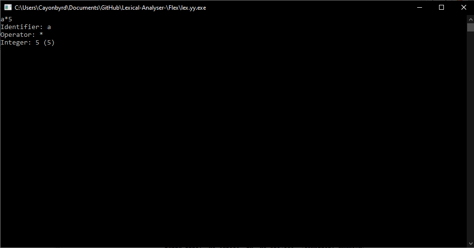
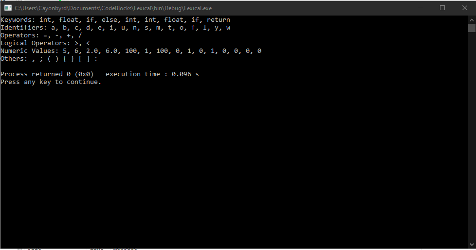

# Lexical-Analyser-
Lexical analysis Lab
I used CodeBlocks and VS Code for the work
Requires to instal GCC MinGW
Installed FLEX

Explanation of the work
-	The lexical analyser has phrases broken down into tokens
-	The scanner identifies tokens based on the defined rules in the source code.
-	The classification of tokens is done after file is read
-	The classification is in groups i.e.
        - Predefined and reserved words grouped as Keywords in C
        - Identifiers
        - Operators
        - Integers
-	The phrases passed in the programs are assigned to their suitable role
- The Flex output 

- The Lexical analyser output

